OAuth provider end user guide
=============================

Introduction
------------

The intent of this guide is to help Plone system administrators to get
started on setting up the OAuth Provider addon to provide a brief
tutorial on using the features that are available out of the box.

Before you start, you will need to have this package included into your
buildout as per the instructions included in the top level documentation
of this package.

Activating the OAuth provider
-----------------------------

To make use of this OAuth provider, please ensure that the add-on is
correctly installed and activated.  This can be done by logging into a
site manager account, then go into `Site Setup`, select `Add-ons`, and
then activate the OAuth Provider Support through that panel.  Once that
is installed you should see it listed under `Activated add-ons`.

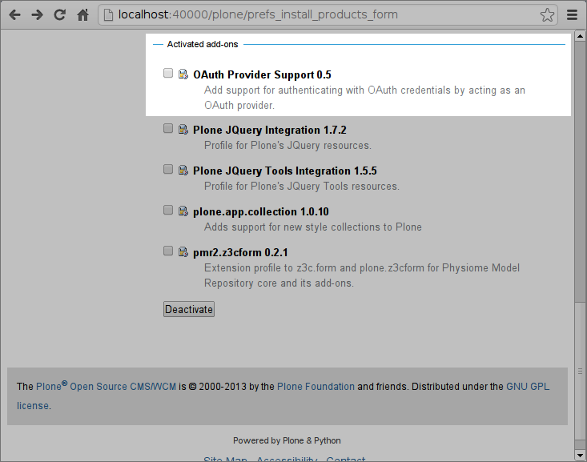

Once that is done, you may return to `Site Setup` and there should be a
new entry under `Add-on Configuration` called `OAuth Provider Manager`.
Please select that.  This will bring you to the product information page
for this OAuth Provider, which also includes links to the management
views if and only if you have the ManagePortal permission.

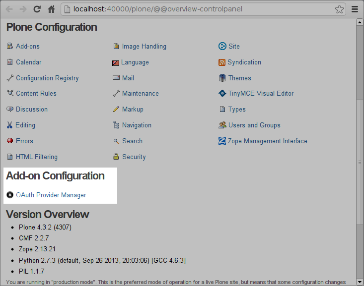

Otherwise, only links to the other pages that are useful to resource
owners (or users) of your site, which permits them manage the
third-party access that they have allowed, and to client application
developers, to inform them on where and what the end-points for clients
might be.

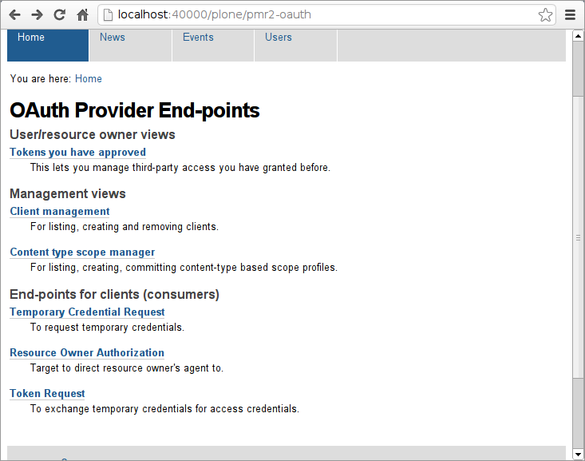

Once the whole scope/realm compatibility issue is sorted out (migration
into the use of OAuth realms, for the consideration of the OAuth 2.0
standard), a page listing all the published/available scopes/realms that
are available to clients and what access they grant will also be
available.  For now you will need to inform application developers on
what those scope identifiers are.

Client configuration
--------------------

First we will start by creating a client, or consumer as it was termed
during the draft stages and the community version of the OAuth 1.0
specification.  You may select the Client management, which will then
lead to a form that lets you add or delete clients that are approved to
interact with your site.

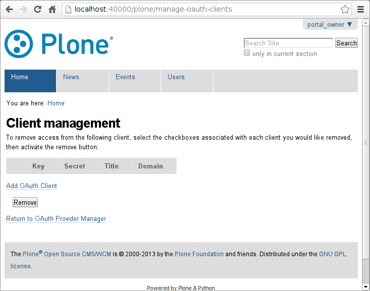

Select `Add OAuth Client`, which will bring you to the form where you
can add a client.  In the example we will fill this out as is.

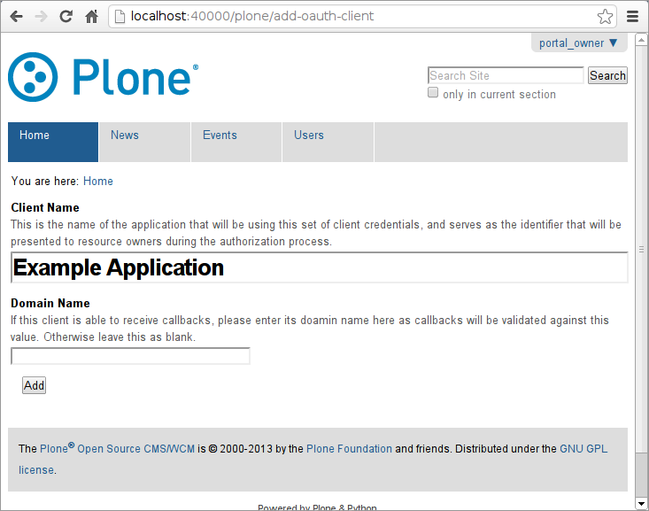

The `Client Name` will be rendered to the resource owners (or your
site's users) as the name of the application that is desiring the access
to their data.  The `Domain Name` is the host of the endpoint that will
receive the callback that contains the verifier so that the client can
know how to verify their identity for the request of the final access
token.

For out-of-band (oob) applications it should be left blank as no
redirection is involved.

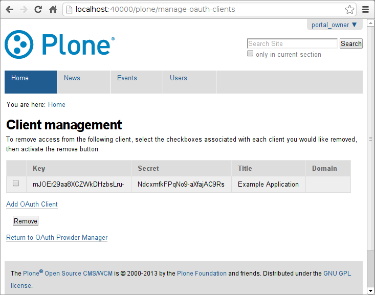

The client example application is now added.

In typical production usage with your customized Plone Add-ons, you may
have a customized process to create and/or to convey the client
credentials to the application developers that are utilizing your web
services; this however is beyond the scope of this tutorial.

Next up is the OAuth scope (which eventually will be migrated into using
OAuth realms).

Scope profile configuration
---------------------------

Scopes are another important key to ensure the security of web services
for both the resource owners and the clients.  The scope serves as a
limit to what the clients can access, and to also inform and assure the
resource owners that clients cannot access more than what is specified.
While this can be better supported through the use of the authentication
parameter realm as specified in RFC2617, this was initially not used due
to the perceived flexibility in using the scope query uri parameter.
This may change in future releases, but for now we will do this.

First off open the Content Type Scope Manager screen.  You should see a
couple links that are both self-explanatory.

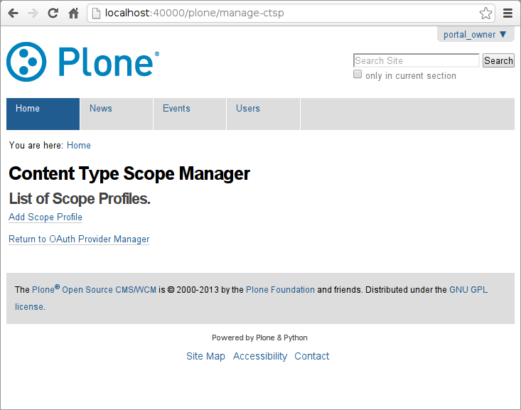

Select `Add Scope Profile` to begin the process of creating a scope
profile.

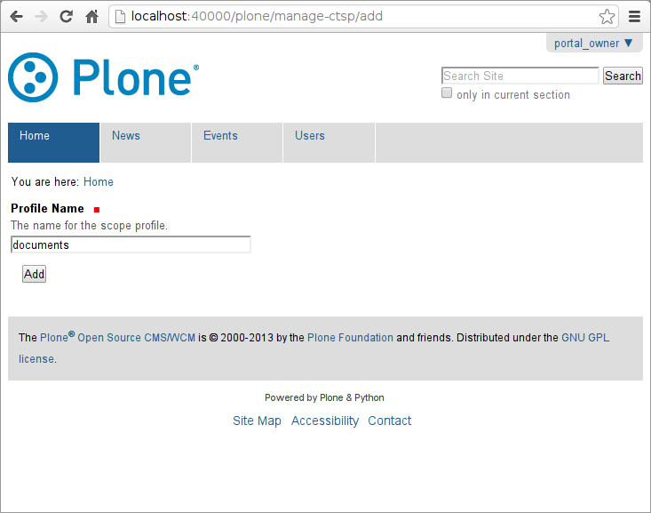

Now fill out the `Profile Name`.  This will eventually be enforced and
encoded as a URL as part of the site, so ideally this should be standard
ASCII characters for ease of use for the clients.

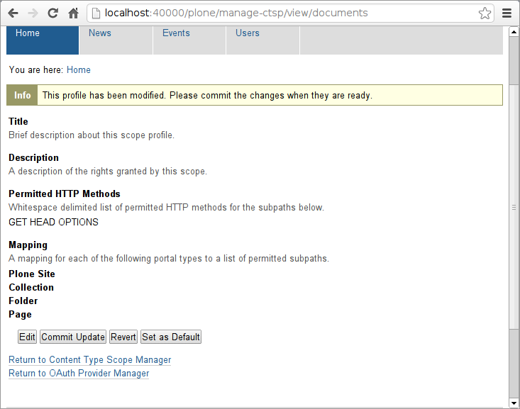

Once you add the profile, you will note that the info message stating
that this profile has been modified. This is normal, as every
modification made to the profile will not be immediately available.  The
scope profile is only made available only after it has been committed,
and any subsequent changes will only be in effect after those changes
are also committed.  Please refer to the next section for details and
rationale for this default behavior.

For now, select Edit to make the changes required to make this scope
profile useful to the clients.

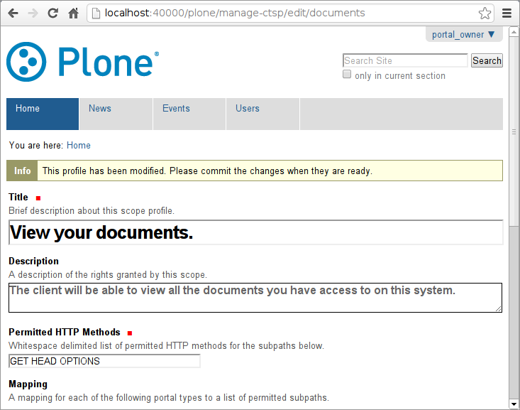

In the first section, this is the information that will be displayed to
the resource owners and it should be a brief summary that explains to
them on what this scope profile will do, i.e. what kind of access will
be granted to the client using the user's account.

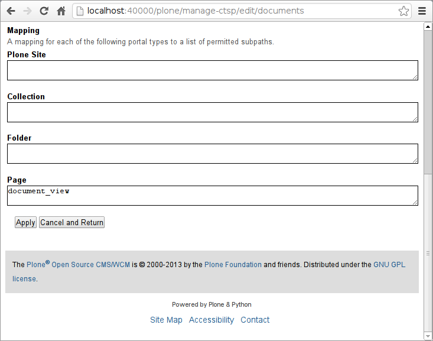

The second section, the mapping, is a list of all content types that are
currently used within this Plone instance.  In the text input area you
can specify all the views, plus the subviews, that you intend to grant
to clients that will make use of this content type scope profile.
Typically the name of these views can be gathered by noting down the
contents of the address bar of your user agent, such as a web browser.

However, default views can be tricky.  To find out the exact name of the
view you wish to allow, please use the ZMI to access the portal_types or
Plone Types Tool (or visit ``${portal_url}/portal_types/manage_main``)
and select the target content type, then scroll down and see what is the
`Default view method` or others that are available from the `Available
view methods` input box. 

For any deployed custom add-ons, the custom views may or may not be
registered into this registry, but this typically can be gathered by
inspecting the URL.

If you need to specify any subpath for the view (e.g. if it has nested
views, or provides an internal traversal implementation) those will have
to be explicitly specified.  For instance, if you want to provide a
scope profile that permit the access of this content type scope profile
manager, you only have to include ``manage-ctsp`` and ``manager-ctsp/*``
inside `Plone Site`.  You can even permit modifications!  All you have
to do is to add the POST method to the list of `Permitted HTTP Methods`.
Of course I consider this a bad idea, but it can be done.

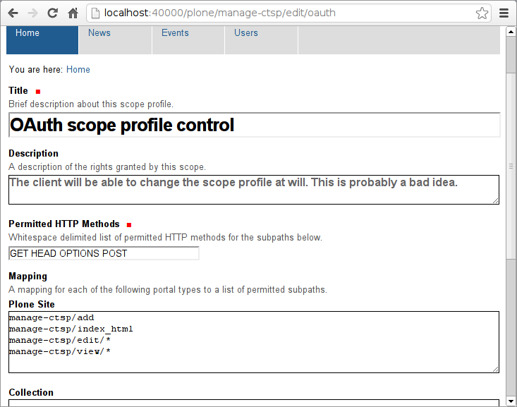

Another caveat: some views for the default Plone content types may not
work as you think it would, as there may be wrapper content types that
are hidden and thus not editable through this interface.  For cases like
those, it is better to create your add-on with the named views
registered to return the specific contents that you desire.

You should now save the profile by selecting "Apply".  If you then
select "Cancel and Return" it will return you to the overview page for
this profile.  You may then select "Commit Update" which would then
enable the changes made to this profile be of use to any future
credentials issued.  The notice will appear once more if you apply
another change to this through the edit form.

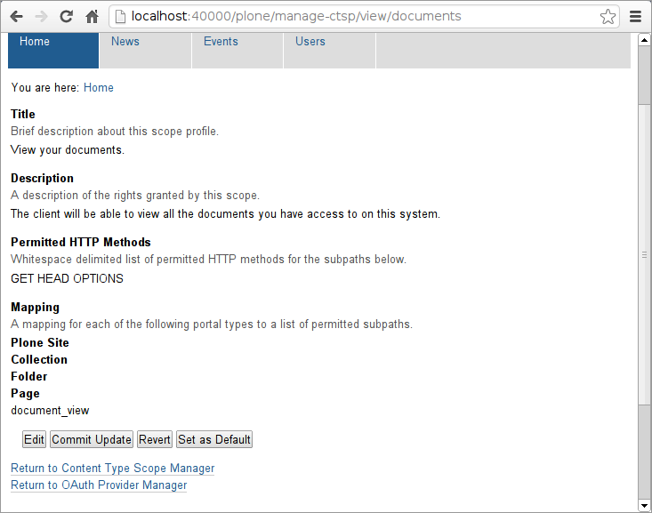

Why go through the scope profile commit process?
~~~~~~~~~~~~~~~~~~~~~~~~~~~~~~~~~~~~~~~~~~~~~~~~

At the point in time of the creation of a temporary credential, any
given scope profiles associated with it that are maintained even after
the conversion into a token credential, and cannot normally be changed
under standard operational conditions.  This includes any subsequent
modifications to the scope profile(s) that are originally involved -
subsequent usage/asociation of that profile to any credential will only
affect those specific future temporary/token credentials.

This behavior is implemented to protect both the client from a sudden
inconsistent permission grant and/or revocation, and resource owners
from unnotified and/or unintended information leakage and/or sudden
application malfunction from any future changes made to the scope
profile.

Of course, if the scope manager that are in effect suddenly changes,
the behavior is currently undefined.  It would likely result in the
tokens no longer functioning for the clients until either new tokens
are created and/or the original scope manager (the content type scope
manager outlined here) is restored as the primary one.

Making use of the client credentials and the scope profiles
-----------------------------------------------------------

Now that the server side pieces are in place, let's test out some client
side interactions.  It should be fairly similar between all the
different versions of OAuth library.  For now we will use `rauth`_ and
assume you have that installed on your test system.  In order to set up
all the end-points, remember they are available in the OAuth Provider
Management view which is accessible from the Add-on Configurations under
Site Setup.

.. _rauth: https://pypi.python.org/pypi/rauth

Temporary credentials
~~~~~~~~~~~~~~~~~~~~~~

The resource owners typically trigger the request that prompts the
client to make the request for temporary credentials.  We will emulate
that here.

First off import the appropriate classes and instantiate an instance::

  >>> from rauth import OAuth1Service
  >>> 
  >>> service = OAuth1Service(
  ...     name='example',
  ...     consumer_key='mJOEr29aa8XCZWkDHzbsLru-',
  ...     consumer_secret='NdcxmfkFPqNo9-aXfajAC9Rs', 
  ...     request_token_url='http://localhost:40000/plone/OAuthRequestToken',
  ...     access_token_url='http://localhost:40000/plone/OAuthGetAccessToken',
  ...     authorize_url='http://localhost:40000/plone/OAuthAuthorizeToken',
  ... )

Now that the service and all the associated end-points are configured,
it is now possible to acquire a temporary credential::

  >>> request_token, request_token_secret = service.get_request_token(params={
  ...     'scope': 'http://localhost:40000/plone/scope/documents',
  ...     'oauth_callback': 'oob',
  ... })

The client at this point is ready to inform the resource owner who made
this request that this temporary credential need to be authorized and
associated with the resource owner's account::

  >>> print authorize_url
  http://localhost:40000/plone/OAuthAuthorizeToken?oauth_token=0iQdRp03m633VQ2Z-hKpXYNI

Authorizing the temporary credentials
~~~~~~~~~~~~~~~~~~~~~~~~~~~~~~~~~~~~~

The user (well, you) could launch a private browser instance and log
into a different, limited user account to test this out to emulate this
process.

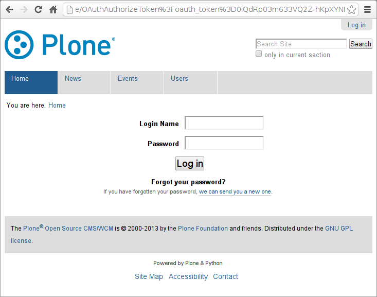

The user, if they are not already logged into the site, will see this.

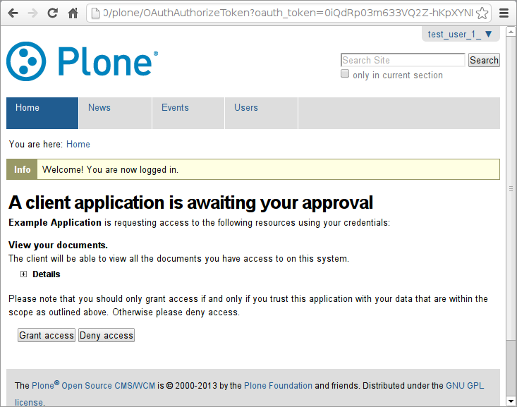

After they log in using the system login form, they will be redirected
to the authorization page.

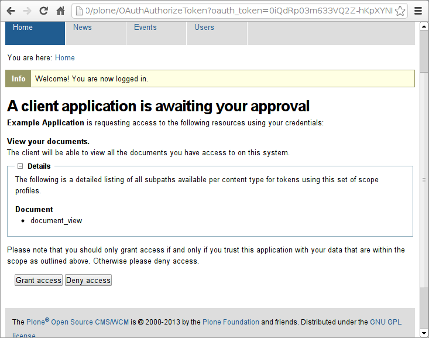

They will be able to expand on the details to see which views and
content types this client will be able to access of access is granted.

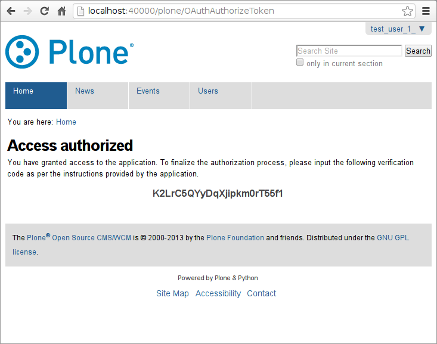

If they grant access, in this case they will be shown a verification
code.  Otherwise in a production web-application, the system will
redirect them to the external site (provided that no other security
mechanism will prevent that) and the verification code will then be
conveyed to the client as per the OAuth standards.  At this point the
actual token credentials can be acquired.

Acquiring the token credentials
~~~~~~~~~~~~~~~~~~~~~~~~~~~~~~~

We will enter the verifier into the client's system manually like so::

  >>> verifier = 'K2LrC5QYyDqXjipkm0rT55f1'

Then they will exchange the verifier and acquire an authenticated
session like so::

  >>> session = service.get_auth_session(request_token, request_token_secret,
  ...     params={"oauth_verifier": verifier})

No errors, so far so good.

Using the token credentials
~~~~~~~~~~~~~~~~~~~~~~~~~~~

The client can now access the document using the session.  Before that
though, let's get our user to create some documents first.  This is very
standard Plone stuff, but the following shows what exactly the user did:

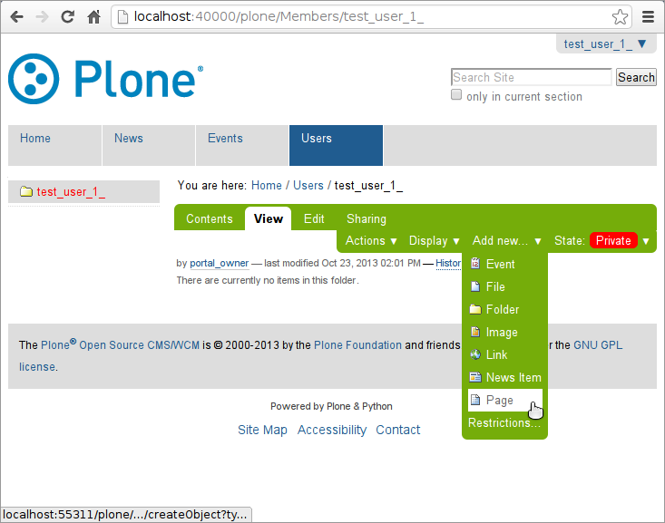

User tries to create a page.

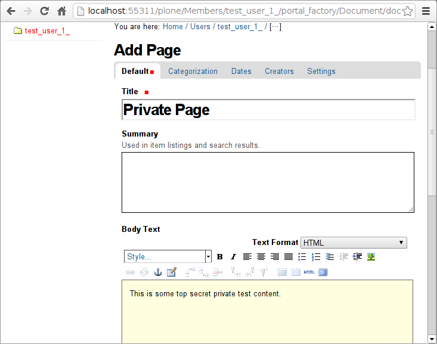

User fills out some information and content.

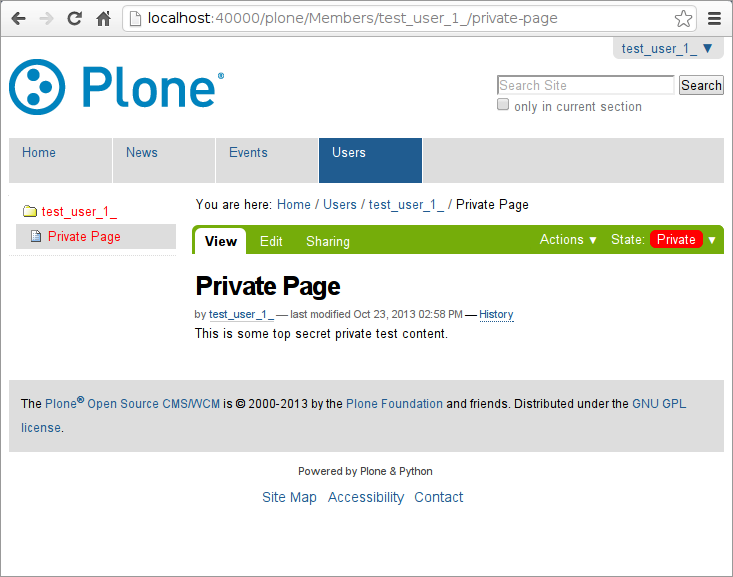

User saves the page, and leaves the content as private.

If our client tries to access this document through normal channels::

  >>> import requests
  >>> response = requests.get(
  ...     'http://localhost:40000/plone/Members/test_user_1_/private-page')
  >>> response.history
  (<Response [302]>,)

Yup, no access, in fact, redirection to login page which isn't useful.
Now retry using the session::

  >>> response
  <Response [200]>
  >>> 'Private Page' in response.text
  True
  >>> 'This is some top secret test data.' in response.text
  True
  >>> 'test_user_1_' in response.text
  True

Revoking access
---------------

This clearly works better.  The resource owner can of course revoke
access.  They can access the OAuth Provider Manager page, too.

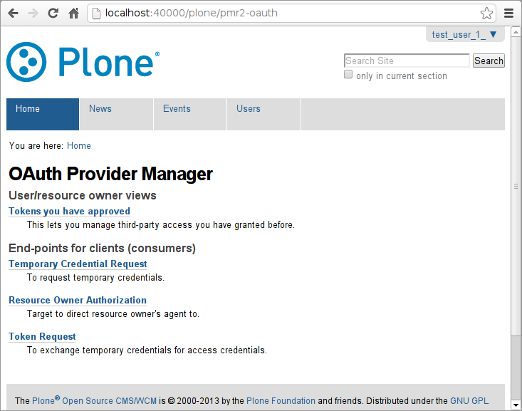

As you can see, standard users don't have the management interfaces
linked and they would be denied access to those forms.  They could
however see which tokens they have approved.

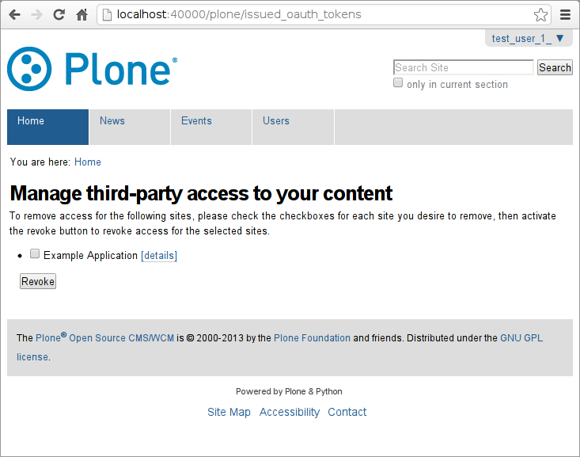

If they select details they will see the scope that was associated with
that token at the time of its creation which the resource owner was
previous presented with.  Alternatively they can select the checkbox,
then "Revoke", and the access will then immediately be revoked from the
client.

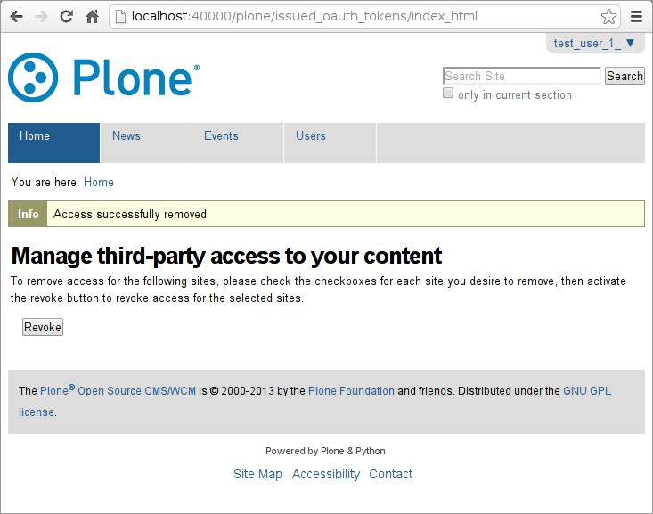

If the client tries again::

  >>> session.get('http://localhost:40000/plone/Members/test_user_1_/private-page')
  <Response [403]>

403 Forbidden.

This concludes the brief tutorial.
